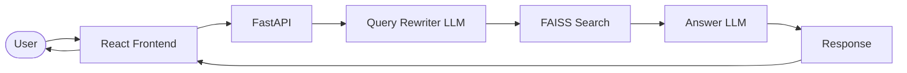

# QalbAI · قلب AI

**مساعد RAG في أمراض القلب بالدارجة التونسية — A Tunisian Arabic (Darija) cardiology RAG assistant.**

Medical RAG chatbot: upload a cardiology PDF, ask questions in Darija; the backend retrieves from a FAISS index and answers in natural Tunisian dialect, phrased like a local cardiologist would explain.

## Architecture



The rewriter turns the user’s Darija question into 2–3 formal Medical Standard Arabic queries; each query hits the same embedding space as the PDF chunks. Results are merged by best similarity, then the answer LLM responds in Tunisian dialect.

## Features

- **FAISS persistence** — `index.faiss` and `chunks.json` under `RAG_STORAGE_PATH`; loaded on startup. `GET /status` returns `{ has_index }` so the UI unlocks without re-upload after deploy restarts.
- **Conversation memory** — Last four user/assistant exchanges in the prompt (`Context → History → Question`).
- **Dialect bridging + multi-query** — First LLM call rewrites Darija → formal Arabic medical strings; parallel FAISS lookups; merged ranking by score.
- **Deploy-oriented client** — `VITE_API_URL`, Arabic fallback errors, animated loading while `/ask` runs.
- **PDF pipeline** — `pdfplumber` with visual-order correction for Arabic text.
- **CPU-only embeddings** — PyTorch CPU + `sentence-transformers` to stay within typical Railway free-tier RAM.

## Tech stack

[](https://www.python.org/)
[](https://fastapi.tiangolo.com/)
[](https://github.com/facebookresearch/faiss)
[](https://www.sbert.net/)
[](https://groq.com/)
[](https://react.dev/)
[](https://vitejs.dev/)

**Embeddings:** `paraphrase-multilingual-MiniLM-L12-v2`  
**LLM (rewrite + answer):** Groq `llama-3.1-8b-instant`

**Frontend:** React + Vite, dark RTL Arabic UI.  
**Deployment:** Backend on Railway (Nixpacks), frontend on Vercel.

## Evaluation

Twenty domain-specific questions on a cardiovascular examination PDF (`backend/evaluate.py`: retries, CSV output, per-topic fields).

| Metric | Value |
|--------|--------|
| Retrieval success | 18 / 20 (90%) |
| Keyword match (mean) | 0.25 |

Keywords in the eval set are formal Arabic; generated answers are in Darija, so keyword overlap underestimates answer quality—use it with retrieval rate, not as a standalone score.

## Repository layout

```
rag-cardiology/
├── backend/
│   ├── main.py
│   ├── requirements.txt
│   ├── nixpacks.toml
│   ├── evaluate.py
│   ├── evaluation_dataset.csv
│   └── services/
│       ├── pdf_service.py      # PDF extraction, Arabic visual-order fix
│       ├── vector_service.py   # FAISS build / search
│       └── llm_service.py      # Groq, prompts, query rewriting
└── frontend/
    └── src/
        ├── App.jsx
        └── components/
            ├── ChatInterface.jsx
            └── PDFUpload.jsx
```

## API

| Method | Path | Description |
|--------|------|-------------|
| `GET` | `/health` | Health check |
| `GET` | `/status` | `{ "has_index": bool }` — polled on load |
| `POST` | `/upload` | PDF → extract, chunk, build FAISS, persist |
| `POST` | `/ask` | `{ question, pdf_id, history }` → `{ answer, sources }` |

## Local development

### Backend

```bash
cd backend
python -m venv .venv
# Windows: .venv\Scripts\activate
# Unix:   source .venv/bin/activate
pip install --find-links https://download.pytorch.org/whl/cpu -r requirements.txt
```

Set `GROQ_API_KEY` and `RAG_STORAGE_PATH` (writable directory). Then:

```bash
uvicorn main:app --reload --host 0.0.0.0 --port 8000
```

First PDF upload writes `index.faiss` and `chunks.json` under `RAG_STORAGE_PATH`.

### Frontend

```bash
cd frontend
npm install
```

Add `.env` with `VITE_API_URL` (e.g. `http://localhost:8000`):

```bash
npm run dev
```

## Environment variables

| Variable | Where | Purpose |
|----------|--------|---------|
| `GROQ_API_KEY` | Backend | Groq OpenAI-compatible API key |
| `RAG_STORAGE_PATH` | Backend | Directory for `index.faiss` and `chunks.json` |
| `VITE_API_URL` | Frontend | API base URL for fetch calls |

## Deployment

- **Backend (Railway)** — Nixpacks (`nixpacks.toml`): Python 3.12, CPU PyTorch wheel index, optional build step to prefetch the embedding model, `uvicorn main:app --host 0.0.0.0 --port $PORT`. Use a volume or persistent path for `RAG_STORAGE_PATH` so the index survives restarts.
- **Frontend (Vercel)** — Vite static build; set `VITE_API_URL` to the public Railway URL. Allow the Vercel origin in FastAPI CORS if you lock origins down.

## Dialect bridging

Tunisian Darija differs from Modern Standard Arabic and from the formal medical Arabic in most PDFs. A single Darija embedding often aligns poorly with textbook prose. The rewriter projects the question into short formal Arabic medical queries so dense retrieval matches document language; the answer model still outputs Darija so the UI stays appropriate for Tunisian users.

## License

MIT
